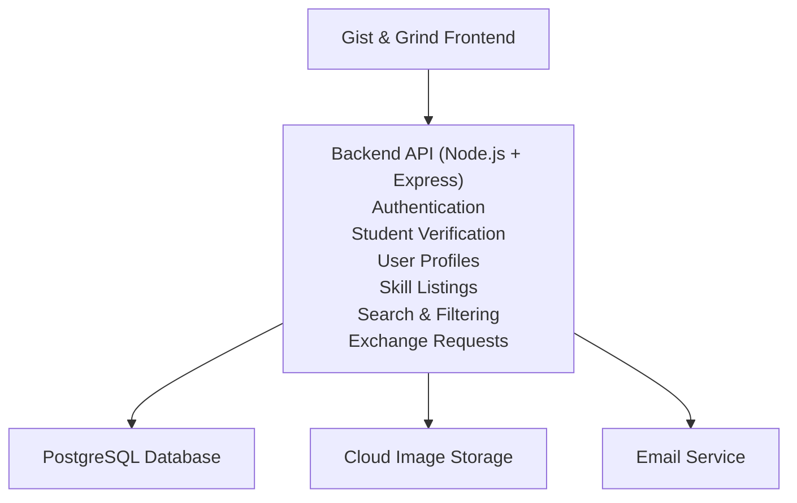

```mermaid
flowchart TD
   A[Gist & Grind Frontend]
   B["Backend API (Node.js + Express)<br/>Authentication<br/>Student Verification<br/>User Profiles<br/>Skill Listings<br/>Search & Filtering<br/>Exchange Requests"]
   A --> B
   C[PostgreSQL Database]
   B --> C
   E[Cloud Image Storage]
F[Email Service]
B --> E
B --> F
```
HELLO
